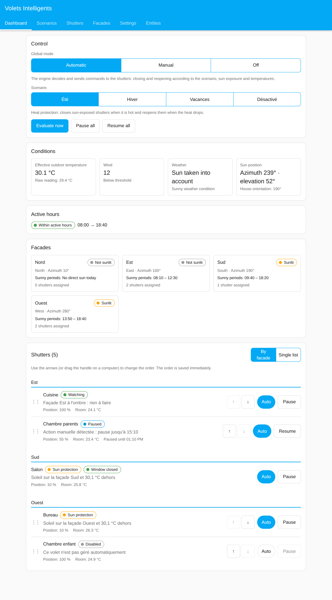
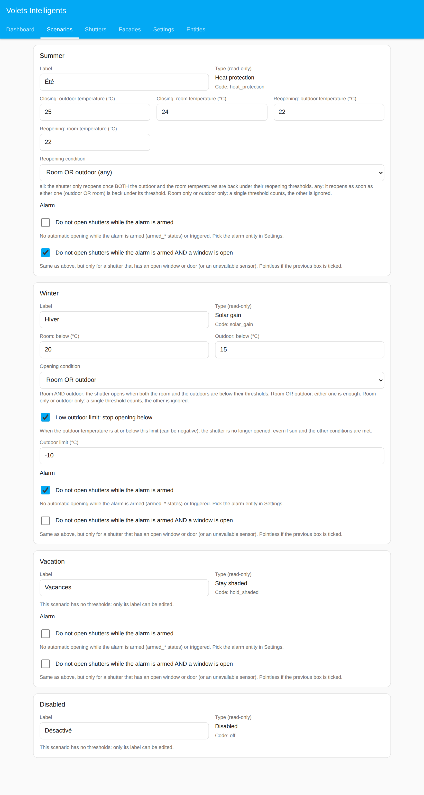
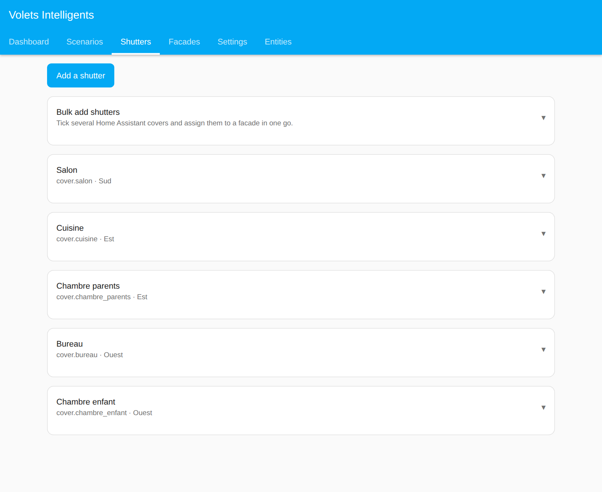
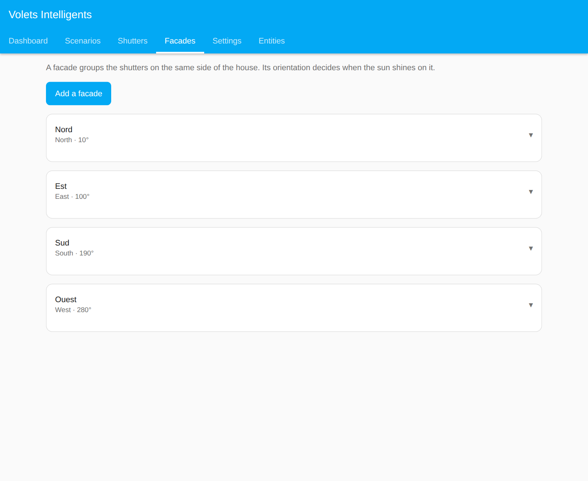
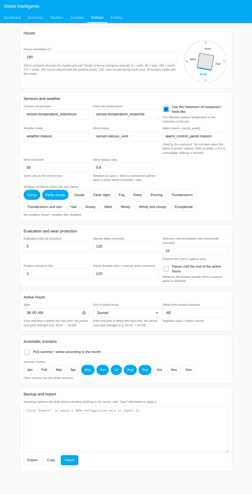
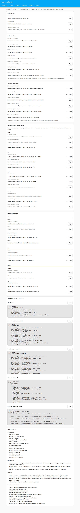

# Volets Intelligents

[Français](README.md) · **English**

Home Assistant integration (HACS) that protects your home from the heat by driving your shutters
according to the sun, the temperatures and the people's activity, with a **graphical management
panel** and a **Lovelace card**. No YAML to write.

> ⚠️ **Disclaimer**
>
> Install and use at your own risk. This project is provided "as is", without any warranty of operation, reliability or fitness for a particular purpose — including regarding the real control of your shutters. No warranty is given either on any code changes that may be made (by you or by third parties).

## What the integration does

### Protection and scenarios

- **Heat protection (Summer scenario)**: a shutter lowers to the wanted position when its facade
  receives the sun AND it is hot outside or in the room. It rises again when the sun leaves the
  facade or the temperatures have dropped.
- **Hysteresis**: separate closing and reopening thresholds (outdoor and room), plus a minimum
  interval between two movements (wear protection).
- **Reopening condition (Summer)**: the protected shutter reopens when **room AND outdoor** are back under
  their thresholds (recommended), when **room OR outdoor** is, or on **the room only** or **the outdoor only**
  (the other threshold is then ignored).
- **Four scenarios**: **Summer** (heat protection), **Winter** (solar gain: reopens a closed, sunny shutter
  when it is cool, never closes), **Vacation** (closes as soon as a facade is exposed, with no temperature
  condition) and **Disabled** (no sun-related action). Chosen manually, or automatically according to the
  month. Each scenario is described under its selector in the panel.
- **Opening condition (Winter)**: your choice of **room AND outdoor** under their thresholds (default),
  **room OR outdoor** (either is enough), **room only** or **outdoor only** (the other threshold is then ignored).
  An optional **low outdoor limit** (can be negative) stops the shutter from opening when the outdoor temperature is
  at or below it. Set in the Scenarios tab.
- **Alarm**: pick an `alarm_control_panel` entity (Settings). Each acting scenario (Summer, Winter, Vacation)
  has two independent options:
  - "**Do not open when the alarm is armed**": no automatic opening while the alarm is armed (`armed_*`
    states) or triggered;
  - "**Do not open when the alarm is armed AND a window is open**": same, but only for a shutter that has an
    open window or door (or an unavailable sensor).

  With no alarm entity, or if it is unavailable, nothing is blocked. Wind safety is never blocked by the
  alarm. Both options are off by default.
- **Thresholds as entities**: each scenario's thresholds (Summer: closing and reopening, outdoor and room;
  Winter: solar gain outdoor and room) are `number` entities you can change from your dashboards.
- **Weather**: an overcast sky can neutralise the effect of the sun.

### Control modes

- **Automatic**: the engine decides and sends the commands to the shutters.
- **Manual**: no command is sent, you drive the shutters yourself; shutters show "Manual mode".
- **Off**: no decision and no command.

Wind safety stays a priority in all three modes. Each mode is described under its selector in the panel.

### Active window

- **Management time window**: adjustable start and end times. The end can be a **fixed time**, **sunset with
  an offset** in minutes (before or after), or **read from an entity** (`sensor`, `input_datetime`,
  `input_text`).
- Adjustable from the panel and from your dashboards (the window's `time`, `select` and `number` entities).

### Facades and sun

- **Four facades, house orientation**: north, east, south, west by default (renamable, removable, you can
  add more). You say which way the facade you call "South" faces: all the facades rotate with it. Each
  shutter is assigned to the facade of your choice.
- **Sun computed for the day**: each facade's exposure is computed from the date, the time and Home
  Assistant's GPS position (sun azimuth and elevation), so it follows the seasons without any sensor.
  Per-facade settings: lighting angle and minimum sun elevation (trees, neighbours). You can also use an
  existing sensor (for example `binary_sensor.volets_exposition_*`).
- **Sunshine windows all day long**: the facade sensors (`sensor.volets_facade_*_debut/fin`) keep their
  value all day (current window, otherwise the next one, otherwise the last of the day), whether the facade
  is exposed or not.

### Controlling each shutter

- **"Auto" button per shutter**: in the panel's dashboard, one click enables or disables automatic
  management of a shutter. It is the equivalent of the `switch.volets_*_auto` entity.
- **Wanted position per shutter**: each shutter has its own protection position (percentage, "favorite
  position" button or full close).
- **Automatic pause after a manual action**: if you move a shutter by hand, it is left alone for the chosen
  duration (or until the end of the active window). The "Paused" status is distinct from a shutter whose
  management is disabled.
- **Open window or door**: closing is blocked (useful for French windows). An unavailable window sensor
  counts as "open": we do not take the risk of locking someone outside.
- **Wind** (blinds and awnings): automatic safety above a threshold, with hysteresis. It takes priority over
  the mode (even "manual" or "off"), the scenario, the pause and the start-up delay; only a shutter whose
  automatic management is disabled escapes it. For each shutter, choose the command that makes it safe:
  "open" (roller shutter raised) or "close" (blind or awning retracted).
- **Fully closed shutter, never raised**: a shutter that is 100 % closed is not raised by the integration,
  however it was closed (by hand, by another automation, by the integration itself). Per-shutter option to
  lift this rule in the scenario(s) of your choice (Summer, Winter, Vacation). Only exception: a shutter
  whose protection is a full close ("close" method or 0 % position) and that the integration closed is
  raised, otherwise its protection would never end. "100 % closed" means a position of 0 % reported by the
  shutter, or a "closed" state for a shutter with no position. The rule also holds for wind protection (a
  closed shutter is already sheltered).

### Safety and transparency

- **Safety**: delay after a restart, no action if the outdoor temperature or the exposure sensor is
  unavailable.
- **Transparency**: each shutter shows, in plain language, why it is in its current state.

### Panel and dashboards

- **Management panel** ("Management interface" from the Configure window): six tabs, see below.
- **Entities for your dashboards**: mode, scenario, thresholds, active window, facades, and an "Auto" switch
  and a status per shutter. The panel's "Entities" tab lists the real identifiers, with ready-to-copy
  examples.

## Installation

1. HACS > Integrations > ⋮ menu > Custom repositories: add this repository (category Integration).
2. Download "Volets Intelligents", then restart Home Assistant.
3. Settings > Devices & services > Add integration > Volets Intelligents.
4. Open the **Volets** panel in the sidebar and configure.

Minimum Home Assistant version: 2026.3.0. The panel and the card are available in French and English.

### Reaching the panel, hiding the sidebar entry

In Settings > Devices & services > Volets Intelligents > **Configure**, the "Show “Volets” in the sidebar"
checkbox lets you remove the sidebar entry. The panel stays reachable at `/volets-intelligents` (link
provided in that same window) and through the **Visit** button on the "Volets Intelligents" device page. The
Lovelace card is not affected. The change reloads the integration (a few seconds).

### Giving other people access to the panel

In the same **Configure** window, the "Designated people (full panel access)" field lets you pick non-administrator
Home Assistant accounts. They get **every tab** of the panel (shutters, facades, scenarios, entities, settings) and
can change anything, like an administrator; access is enforced server-side. Other non-administrator accounts only
see the Dashboard tab. Empty by default (administrators only). Once at least one person is designated, the "Volets"
entry shows in every account's sidebar (hide it with the checkbox above).

### Icon in HACS's update list

The integration ships its icon and logo (`brand/` folder), which Home Assistant 2026.3 and later display on the
integration page. HACS 2.0.5, however, fetches the icon from Home Assistant's old logo server (which has nothing
for a custom integration): "icon not available" is shown in the update list until HACS is fixed
([hacs/integration#5171](https://github.com/hacs/integration/issues/5171)). Meanwhile you can force the image in
`configuration.yaml` (then Developer tools > YAML > Reload customizations, or restart):

```yaml
homeassistant:
  customize:
    update.volets_intelligents_update:
      entity_picture: /volets_intelligents_static/icon.png
```

The `update.volets_intelligents_update` identifier is the one HACS creates; check it in Settings > Entities if
needed. The repository list in the HACS panel itself keeps its default image.

### First steps

1. **House orientation** (Settings): which azimuth does your "South" facade face? 180 if your house is
   aligned with the cardinal points, 135 if the main facade faces south-east.
   GPS coordinates come from Home Assistant's configuration (Settings > System > General).
2. **Outdoor temperature** (Settings): a temperature sensor, and optionally the feels-like temperature.
3. **Shutters**: add your shutters (bulk add possible) and choose each one's facade.

## Configuration in the panel

| Tab | Content |
|---|---|
| Dashboard | Global mode, scenario, temperatures, active window, state of each shutter, pause and resume. |
| Scenarios | Thresholds and conditions of each scenario, alarm options. |
| Shutters | Shutter list: facade, protection position, method, room temperature, windows. |
| Facades | Orientation, lighting angle, horizon mask, the day's sunshine windows. |
| Settings | Outdoor sensors, active window, manual pause, wind, alarm, weather, JSON import and export. |
| Entities | Real identifiers of the integration's entities, ready-to-copy YAML examples, values of the modes and scenarios. |

The screenshots below use demonstration data.

### Dashboard



### Scenarios



### Shutters



### Facades



### Settings



### Entities



### How the sun is computed

A facade's azimuth is its cardinal direction (north 0°, east 90°, south 180°, west 270°) shifted by
"house orientation − 180". A "custom" facade (dormer, roof slope) has its own azimuth.
It is lit when the sun is above the minimum elevation AND within the lighting angle (80° by default) of the
perpendicular to the facade. This is simple geometry: it knows nothing about roof overhangs or obstacles,
which you compensate for with the minimum elevation or an exposure sensor.

### Heat protection rules

An **unprotected** shutter closes if: the facade is exposed AND (effective outdoor temperature > outdoor
closing threshold OR room temperature > room closing threshold). The effective outdoor temperature is the
maximum of the measurement and the feels-like temperature.

A shutter **protected by the integration** rises if the facade is no longer exposed, or according to the
release mode:

- `all` (recommended): outdoor under the opening threshold AND room under the opening threshold. Prevents the
  room, cooled by the closed shutter, from making it reopen in full sun.
- `any`: the old automation's behaviour, one of the two is enough (outdoor OR room).
- `room`: only the room counts (under its opening threshold).
- `outdoor`: only the outdoor counts (under its opening threshold).

At the end of the active window, shutters that are still protected rise.

## Entities for your dashboards

The integration creates a "Volets Intelligents" device that groups all its entities. The identifiers below are
the **usual** ones: Home Assistant builds them from the shutter's name when it is created. Check yours in
Settings > Devices & services > Volets Intelligents (or by searching "volets" in Settings > Entities). In the
examples, `bureau` is to be replaced by your shutter's name.

### Global entities

| Entity | Type | Values | Usage |
|---|---|---|---|
| `select.volets_mode` | select | `auto`, `manual`, `off` (displayed Automatic, Manual, Off) | Global mode. **Automatic**: the engine decides and sends the commands. **Manual**: no command sent (shutters show "Manual mode"). **Off**: no decision or command (wind safety stays a priority). Editable from a dashboard. |
| `select.volets_scenario` | select | `summer`, `winter`, `vacation`, `off` (displayed Summer, Winter, Vacation, Disabled) | Active scenario. Editable, except when the automatic month-based scenario is enabled. |
| `sensor.volets_temperature_exterieure_effective` | sensor (°C) | number, or unavailable | Outdoor temperature actually used by the rules (maximum of the measurement and the feels-like temperature if the option is enabled). |

### Active window

| Entity | Type | Usage |
|---|---|---|
| `binary_sensor.volets_plage_active` | binary_sensor | `on` when the current time is inside the active window. |
| `sensor.volets_plage_debut` | sensor (timestamp) | Start of the current active window. |
| `sensor.volets_plage_fin` | sensor (timestamp) | End of the current active window (empty if the end is unavailable). |
| `time.volets_reglage_plage_debut` | time | **Setting** of the start time. Editable from a dashboard. |
| `time.volets_reglage_plage_fin` | time | **Setting** of the fixed end time (also used as a fallback if the end entity is unavailable). |
| `select.volets_reglage_plage_mode_fin` | select | **Setting** of the end mode: `fixed` (fixed time), `entity` (read from an entity), `sunset` (sunset). The `entity` mode requires an end entity to already be chosen in the panel, otherwise the change is refused. |
| `number.volets_reglage_plage_decalage_coucher` | number (min) | **Setting** of the offset from sunset (-240 to 240, useful in `sunset` mode). |

### Scenario thresholds

| Entity | Type | Usage |
|---|---|---|
| `number.volets_seuil_ete_fermeture_exterieur` | number (°C) | **Setting**: summer, closing when the outdoor temperature reaches this threshold. |
| `number.volets_seuil_ete_fermeture_piece` | number (°C) | **Setting**: summer, closing when the room temperature reaches this threshold. |
| `number.volets_seuil_ete_reouverture_exterieur` | number (°C) | **Setting**: summer, reopening under this outdoor threshold. |
| `number.volets_seuil_ete_reouverture_piece` | number (°C) | **Setting**: summer, reopening under this room threshold. |
| `number.volets_seuil_hiver_gain_exterieur` | number (°C) | **Setting**: winter, solar gain when the outdoor temperature is under this threshold. |
| `number.volets_seuil_hiver_gain_piece` | number (°C) | **Setting**: winter, solar gain when the room temperature is under this threshold. |

They change the matching scenario; the "vacation" and "disabled" scenarios have no thresholds.

The entity that provides the window end (for example `sensor.volets_heure_remontee`) is chosen in the panel
(Settings). Each change made through these entities is saved as if it came from the panel.

### Facades: exposure and times

One set of entities per facade (North, East, South, West and the facades you added):

| Entity | Type | Usage |
|---|---|---|
| `binary_sensor.volets_facade_<name>_exposee` | binary_sensor | `on` when the facade receives the sun (weather included), `off` otherwise, unknown if the exposure sensor is unavailable. Attributes: `facade`, `orientation`, `azimuth`, `source` (`sun` or `entity`), `windows` (all of the day's theoretical sunshine windows). |
| `sensor.volets_facade_<name>_debut` | sensor (timestamp) | Start of the current sunshine window, otherwise of the next one, otherwise of the last of the day. Empty if the facade is never exposed that day, or in "existing sensor" mode. |
| `sensor.volets_facade_<name>_fin` | sensor (timestamp) | End of that same window. |

These entities have names different from any `binary_sensor.volets_exposition_*` sensors you may have: there is
no conflict. The times are theoretical (sun geometry, no weather or obstacles) and refresh at each evaluation
(every 5 minutes by default).

### Entities per shutter

| Entity | Type | Description |
|---|---|---|
| `switch.volets_<name>_auto` | switch | Automatic management of the shutter: `on` = managed, `off` = ignored by the integration. Replaces the `input_boolean.auto_volet_*`. |
| `sensor.volets_<name>_statut` | sensor (enum) | Shutter status (see below). The plain-language explanation and the other information are in the attributes. |

Status values (`sensor.volets_<name>_statut`):

| Value | Display | Meaning |
|---|---|---|
| `shaded` | Shaded | The shutter was lowered by the integration. |
| `watching` | Watching | Nothing to do for now. |
| `paused` | Paused | Manual action detected, or pause requested. |
| `window_open` | Window open | Closing blocked (or window sensor unavailable). |
| `wind_protected` | Wind-protected | Made safe because of the wind. |
| `cooldown` | Wear protection | Waiting for the minimum interval between two movements. |
| `outside_window` | Outside window | Outside the active window. |
| `grace` | Start-up | Safety delay after a restart. |
| `no_data` | Missing data | Outdoor temperature or exposure unavailable: no action. |
| `mode_manual` | Manual mode | The global mode is "manual". |
| `mode_off` | Off | The global mode is "off". |
| `scenario_off` | Scenario disabled | The active scenario drives no shutter. |
| `disabled` | Disabled | Shutter not managed (switch `off`). |
| `unavailable` | Unavailable | The shutter entity is unavailable. |

The display texts are shown in the language of your Home Assistant.

Attributes of `sensor.volets_<name>_statut`:

| Attribute | Content |
|---|---|
| `reason` | Plain-language sentence explaining the situation (for example "Sun on the East facade and 27.4 °C outside"; the text is in French). |
| `cover` | The driven shutter entity (for example `cover.calyps_home_volet_bureau`). |
| `position` | Current position as a percentage, or empty if the shutter does not report one. |
| `room_temp` | Room temperature used, or empty. |
| `exposed` | `true` if the facade receives the sun (weather included), `false` otherwise, empty if the information is unavailable. |
| `paused_until` | Date and time the pause ends, or empty. |
| `shaded_by_us` | `true` if the integration lowered the shutter. |
| `last_action` | The integration's last action: `close` or `open`. |
| `last_action_at` | Date and time of that action. |
| `window_state` | State of the shutter's opening sensors: `open`, `closed`, `unknown` (sensor unavailable), empty if no sensor. A single open window is enough for `open`. |

A shutter's entities appear or disappear when you add or remove the shutter in the panel.

**"Entities" tab of the panel.** It lists the real identifiers of your installation's entities (read from Home
Assistant, so exact even if you renamed them), with a "Copy" button per identifier, the list of possible
values, and YAML card examples already filled in with your identifiers.

### Ready-to-copy examples

Global control (adapt if your identifiers differ):

```yaml
type: entities
title: Volets intelligents
entities:
  - entity: select.volets_mode
    name: Mode
  - entity: select.volets_scenario
    name: Scenario
  - entity: sensor.volets_temperature_exterieure_effective
    name: Outdoor temperature used
```

A shutter with its switch, its status and the explanation:

```yaml
type: entities
title: Office
entities:
  - entity: cover.calyps_home_volet_bureau
  - entity: switch.volets_bureau_auto
    name: Automatic management
  - entity: sensor.volets_bureau_statut
    name: Status
  - type: attribute
    entity: sensor.volets_bureau_statut
    attribute: reason
    name: Why
```

Explanation of several shutters in a Markdown card:

```yaml
type: markdown
title: Shutters, why?
content: >
  **Office**: {{ state_attr('sensor.volets_bureau_statut', 'reason') }}

  **Living room**: {{ state_attr('sensor.volets_salon_statut', 'reason') }}
```

Count the shutters currently lowered by the integration (a template ready to paste into a Markdown card or
a template sensor):

```yaml
{{ states.sensor
   | selectattr('attributes.volets_intelligents', 'defined')
   | selectattr('state', 'eq', 'shaded')
   | list | count }}
```

All the status sensors carry the `volets_intelligents: true` attribute, which lets you find them without
listing their names, for example with the `auto-entities` card:

```yaml
type: custom:auto-entities
card:
  type: entities
  title: Shutter status
filter:
  include:
    - domain: sensor
      attributes:
        volets_intelligents: true
```

### Services

| Service | Fields | Effect |
|---|---|---|
| `volets_intelligents.pause` | `entity_id` (shutters, all if empty), `minutes` (duration from the settings if empty) | Pauses shutters. |
| `volets_intelligents.resume` | `entity_id` (all if empty) | Resumes automatic management. |
| `volets_intelligents.evaluate` | none | Forces an immediate evaluation. |

```yaml
type: button
name: Pause 2 h, living room
tap_action:
  action: perform-action
  perform_action: volets_intelligents.pause
  data:
    entity_id: cover.calyps_home_volet_canape
    minutes: 120
```

## Lovelace card

The card is loaded automatically. Add it from the dashboard editor ("Volets Intelligents") or in YAML:

```yaml
type: custom:volets-intelligents-card
title: Shutters
```

## User permissions

Permissions follow Home Assistant's: the management panel is reserved for administrators. The Lovelace card
is visible to everyone, but changing the mode or the scenario, pausing or resuming a shutter requires control
permission on the matching entity (`select.volets_mode`, `select.volets_scenario`, the shutter itself), like
any service call.

## Active window

The active window runs from a start time to an end time (fixed, read from an entity, or relative to sunset).
If the end is before the start, the window crosses midnight (e.g. 20:00 → 02:00). If the end entity is
unavailable, the fixed end time is used as a fallback.

## Inspirations and differences

The project takes the logic of its author's "VOLETS : Thermique" automation (expected exposure by orientation,
per-room temperatures, thresholds, window up to the reopening time) and draws on the ideas of the
[CoverAutomatic](https://github.com/crandler/CoverAutomatic) project (hysteresis, pause after a manual action,
open window, wind, start-up delay, scenarios). No code was copied.

## Known limitations

- The `shaded` statuses and the pauses rely on the position reported by the shutter. A shutter that reports no
  position is handled as all-or-nothing.
- With the "button" mode (favorite position), the position reached may differ from the configured protection
  position: the integration still recognises a shutter it lowered and raises it afterwards.
- If the integration lowers a shutter to 10 % and you then close it completely, it gives up on it: it stays closed.
- A movement coming from another automation (alarm, evening closing) during the active window is treated as a
  manual action and pauses the shutter.

## Development

```bash
pip install ruff
ruff check .
```

The decision engine (`engine.py`) and the validation (`schema.py`) do not import Home Assistant and can be
imported on their own. The frontend (`frontend/`) is plain JavaScript, with no build step. The data contract
between frontend and backend is described in `docs/API.md`.

The sunshine windows displayed are theoretical (geometry only, no weather).

MIT licence.
